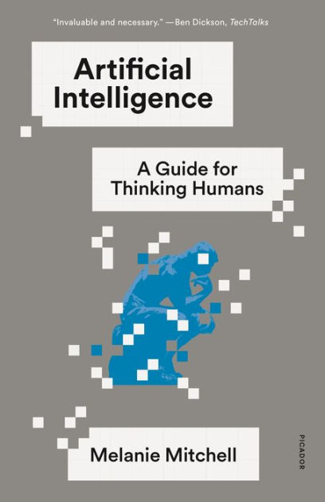

When I first decided that I wanted to seriously learn about artificial intelligence, I spent some time looking for a good place to start. I wasn't looking for a programming book or a superficial overview, but something that would give me a solid understanding of what AI actually is, what it can do, and some of its limitations.

That search led me to Melanie Mitchell's *Artificial Intelligence: A Guide for Thinking Humans*. It became the first AI book I read as part of that learning journey.

*Artificial Intelligence: A Guide for Thinking Humans* is an accessible and thought-provoking exploration of AI, its history, capabilities, and limitations. I started listening to this book on Audible, but the book references a number of images and figures. While there is an accompanying PDF containing those images, I ended up purchasing the print version as well.

Mitchell is a computer scientist, and she demystifies AI by explaining key concepts like machine learning, neural networks, and common misconceptions while addressing the challenges of achieving true intelligence. She examines AI’s successes and failures, highlighting the gap between human and machine cognition. Through engaging examples and a balanced perspective, the book provides a nuanced understanding of AI’s current state and future potential, making it an essential read for anyone curious about the field.

While the book is somewhat dated—for instance, it doesn’t cover generative AI, which is currently making headlines—it still provides a compelling overview of key AI concepts, explaining them in a thorough and accessible manner. I found the book extremely fascinating and well worth the time invested.
