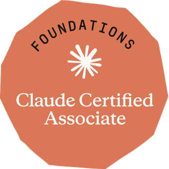

Over the past year, I have spent a lot of time studying artificial intelligence and working hands-on with both Anthropic’s Claude and OpenAI’s ChatGPT. Along the way, earning a certification from one of those companies became one of my goals.

At the beginning of August, my manager asked me to pursue the Claude Certified Architect (Foundations) certification. As I started reviewing Anthropic’s certification options, I decided to begin with the Claude Certified Associate – Foundations credential as my first Anthropic certification.

## What the certification covers

There is no API development, coding, or software engineering requirement. Instead, the exam focuses on whether you understand how to use Claude effectively for business and productivity work.

That includes areas such as prompt engineering, evaluating the quality of AI-generated output, choosing the appropriate Claude product feature or model, configuring Claude Projects, and using AI responsibly within an organization.

## How I prepared

I have been using both Claude and ChatGPT for almost two years, so I already had a good working understanding of both tools. I still spent time going through formal training and practice questions.

- The Ultimate Claude Certified Associate Cert. Training by Vladimir Raykov on Udemy
- Anthropic’s official certification training
- Several sets of practice exams on Udemy

Of the practice exams I tried, I found Frank Kane’s exams particularly useful. They were actually more difficult than the certification exam itself, which made them good preparation.

The preparation paid off. I missed only one question on the actual exam.

## Who is this certification for?

I think this certification is useful for anyone who wants a better understanding of how to use Claude in a professional environment.

The certification also covers when AI is appropriate, when it is not appropriate, governance considerations, model usage, and situations where the right answer is to defer to human judgment rather than relying on AI.

## What’s next

This was my first Anthropic certification. I have already started preparing for the next exam, the Claude Certified Architect (Foundations) certification, exam CCAR-F.

## Claude Certified Associate – Foundations (CCAO-F)

Issued by Anthropic

Earned August 25, 2026

**Skills:** Claude Projects, Knowledge Management, Model Selection, Output Evaluation, Prompt Engineering, Responsible AI, Troubleshooting, Workflow Integration.

[View the credential on Credly](https://www.credly.com/badges/61e8cb96-7f35-45e4-93d5-89c3dac2aaf7)
