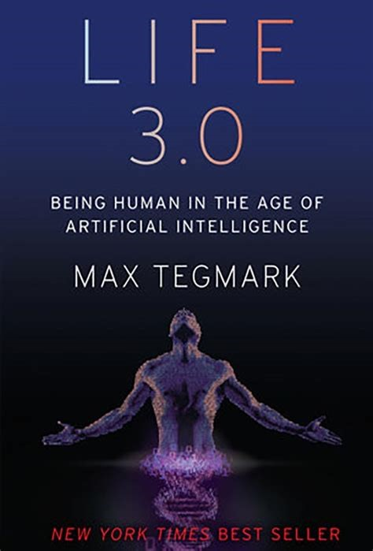

Life 3.0: Being Human in the Age of Artificial Intelligence by Max Tegmark is an ambitious exploration of the future of artificial intelligence and its implications for humanity. While the book offers a broad and thought-provoking perspective on AI’s potential trajectories, it may not satisfy readers seeking a technical understanding of how AI systems function.

Tegmark, a physicist and co-founder of the Future of Life Institute, categorizes life into three stages: Life 1.0 (biological evolution), Life 2.0 (cultural evolution), and Life 3.0 (technological evolution). He envisions a future where AI surpasses human intelligence, leading to scenarios ranging from utopian to dystopian. The book delves into topics like consciousness, ethics, and the long-term fate of intelligent life in the universe.

Life 3.0 is a compelling read for those interested in the philosophical and ethical implications of AI. It challenges readers to consider the long-term consequences of AI advancement and our role in shaping its trajectory. However, for individuals seeking a deeper understanding of AI’s technical aspects, like me, this book may not meet their expectations.
