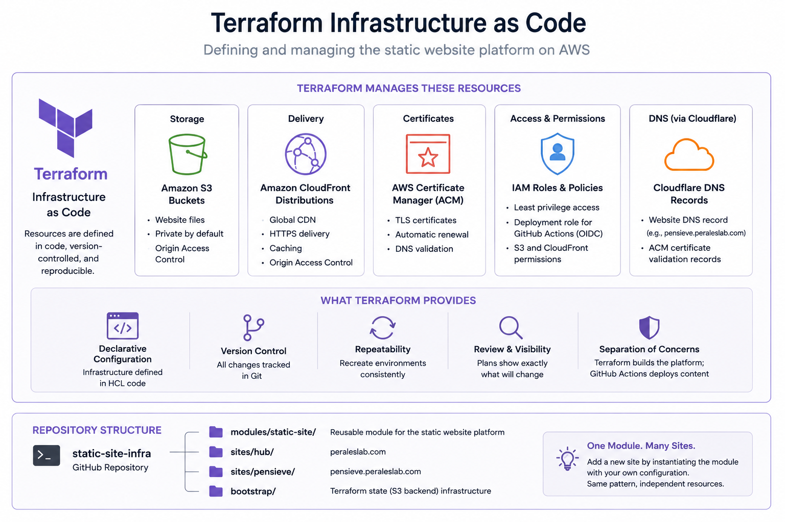

## Infrastructure as Code

Terraform defines the AWS resources that support the static websites, including:

* Amazon S3 buckets
* Amazon CloudFront distributions
* AWS Certificate Manager certificates
* IAM roles and deployment permissions
* DNS-related configuration

Managing these resources as code means the infrastructure can be reviewed, version-controlled, and recreated without relying on manual configuration through the AWS console.

It also gives me a record of how the environment is actually built.

## Building a Reusable Pattern

Rather than defining a separate infrastructure stack for each website, I created a reusable Terraform module for the common static-site components. Each site can use the same module while providing its own configuration. This allows multiple websites to follow the same architecture while still being managed independently.

Terraform provisions and manages resources such as the S3 bucket, CloudFront distribution, certificates, and IAM permissions. GitHub Actions then builds the Hugo site and publishes the generated files into that existing environment.

The biggest benefit of this approach is repeatability. Once the static-site module was established, the same infrastructure pattern could be reused for additional sites without designing the AWS environment from scratch each time.

The module and site configurations are available on GitHub: [github.com/peralese/static-site-infra](https://github.com/peralese/static-site-infra).
