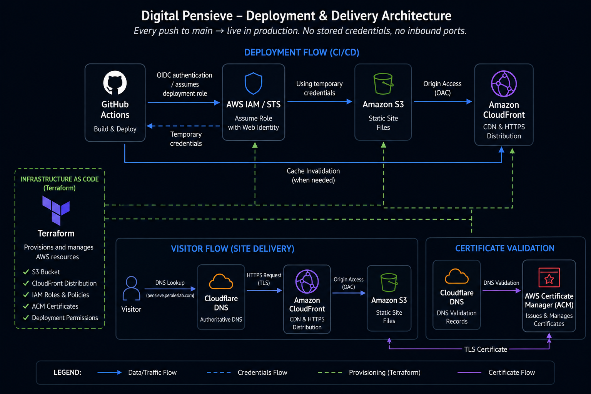

Before creating the Digital Pensieve, I maintained a personal blog using Google's Blogger platform. I originally created the site as a place to publish book reviews, share recipes, and document my gardening interests.

Blogger provided an easy way to get started, but over time its limitations became more noticeable. After registering the peraleslab.com domain, rebuilding the blog became one of my first projects.

The result was the Digital Pensieve, a new version of my personal blog hosted at [pensieve.peraleslab.com](https://pensieve.peraleslab.com).

The new site preserves the original purpose of the Blogger site while expanding its scope.

It still includes content about:

* Books and book reviews
* Recipes and cooking
* Gardening

The site also provides space for additional interests, including travel and other personal topics.

## Framework

I selected Hugo as the framework for the new site. Hugo is a static-site generator that converts content and templates into a set of HTML, CSS, JavaScript, and other static files. Because the finished site does not require a traditional application server or database, it is well suited for hosting in an Amazon S3 bucket and distributing through Amazon CloudFront.

## Hosting the Site on AWS

One of my goals was to host and operate the website using AWS rather than moving it to another managed blogging platform.

The generated Hugo site is stored in an S3 bucket. CloudFront sits in front of the bucket and provides the public HTTPS endpoint, content caching, and global distribution.

The peraleslab.com domain is registered through Amazon Route 53, while Cloudflare manages the DNS records that direct pensieve.peraleslab.com to the CloudFront distribution. Cloudflare also contains the DNS validation records used by AWS Certificate Manager.

## Infrastructure and Automated Deployment

The AWS infrastructure supporting the site is defined and managed using Terraform. This includes the S3 bucket, CloudFront distribution, IAM roles, certificate-related configuration, and permissions required by the deployment pipeline. Managing these resources as code makes the environment easier to review, reproduce, update, and version-control than configuring each component manually through the AWS console.

The website source code and content are maintained in GitHub. When changes are pushed to the main branch, a GitHub Actions workflow installs the required Hugo version, builds the static site, uploads the generated files to S3, and invalidates the CloudFront cache when necessary. Once the workflow completes, the updated site becomes publicly available.

To authenticate with AWS, the workflow uses OpenID Connect, or OIDC, rather than storing permanent AWS access keys in GitHub. GitHub Actions requests a short-lived identity token, which AWS validates before allowing the workflow to assume an IAM role with only the permissions required to deploy the site.

## Establishing a Reusable Deployment Pattern

The Digital Pensieve was the first site where I used this complete deployment pattern:

**Terraform-provisioned AWS infrastructure supporting a Hugo → GitHub → GitHub Actions → OIDC → S3 and CloudFront deployment pipeline.**

Terraform creates and manages the underlying infrastructure, while GitHub Actions builds and deploys the Hugo site whenever changes are pushed to the repository.

After proving the approach on this personal blog, I reused the same general architecture for the main Perales Lab technical site.
