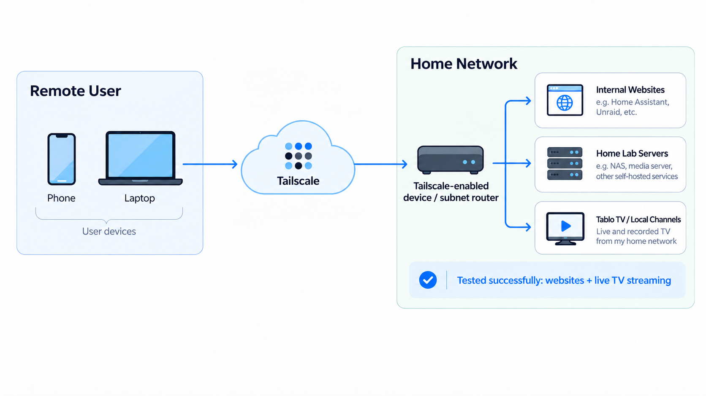

My son, who is currently attending college and living in his own apartment, wanted access to some of the resources I have running at home, including my servers and our Tablo TV system for watching local television.

## Attempt #1: TP-Link VPN

My TP-Link Deco mesh network has built-in VPN capabilities, so that was the first thing we tested. While we were able to establish a connection and access some of my internal websites, the performance was painfully slow. We were seeing transfer speeds measured in kilobits per second.

## Attempt #2: Tailscale

After researching a few other options, I came across Tailscale, a VPN solution built on WireGuard. I installed Tailscale on an always-on server in my home lab and configured it as a subnet router advertising the home LAN. That lets any device signed into our Tailscale network reach everything at home, including the Tablo, Plex, and my dev server, without installing Tailscale on each of those devices.

I tested the setup during a visit to my son's apartment. From my cell phone, I could reach all my internal websites at about the full speed of my home connection, a big change from the kilobits per second we saw with the Deco VPN.

I forgot to test the Tablo on that visit, so I tried it the next time I was at his apartment. Within a couple of seconds, I had a local station loaded and was watching the Dallas Cowboys game on my phone through our home TV system.

## Final Thoughts

Tailscale has worked out well. It provides a simple way to securely access my home lab resources without exposing any of them directly to the internet.
