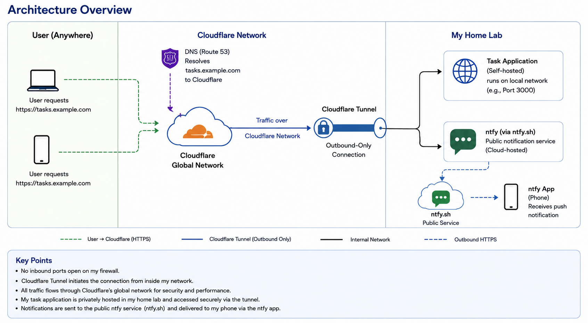
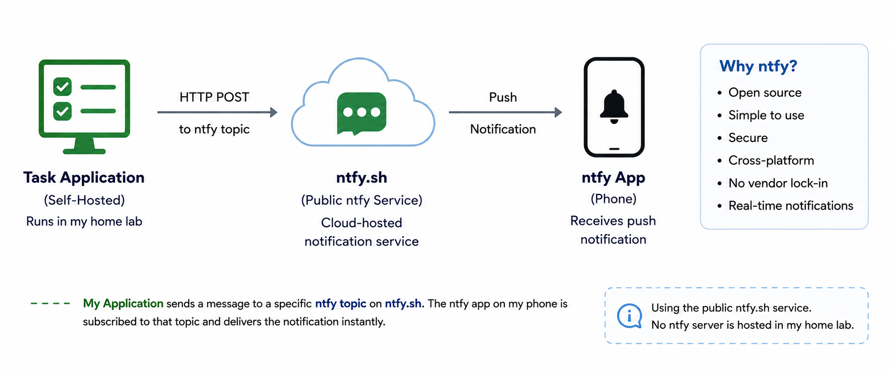

In my previous post I covered my home network and infrastructure. In this post I want to focus on two important components that build on that foundation: the Cloudflare Tunnel that securely exposes my services to the Internet, and the task management application that I built and run inside my home lab.

## Why I Built a New Task Application

I've used the reminder and task apps that come with my iPhone and my computers, but I never really found one that fit the way I think and work. The first application I built (early last year) was a simple Google Forms-based solution. It allowed me to add, update, and delete tasks, set due dates, and email myself reminders when tasks were due.

It worked well at first, but over time I started ignoring the emails. They became noise in my inbox. I would delete them without even reading them. The system was doing its job, but I wasn't.

That led to the current version of my task application. It's a dedicated web application that I host in my home lab. I can manage tasks through a clean interface, and I can continue to evolve it as my needs change.

The last piece of the puzzle was making the application available wherever I am, on any device, not just when I'm on my home network.

## Cloudflare Tunnel: Secure, Simple, and Powerful

Cloudflare Tunnel creates a secure, outbound-only connection from my home lab to Cloudflare's global network. There's no need to open inbound ports on my firewall or expose a public IP address.

Instead, all traffic comes to Cloudflare first. Cloudflare then forwards the traffic through the established tunnel to the application running inside my network. From the outside, users only ever interact with Cloudflare. My home network remains private and protected.

I use Route 53 for DNS. When I enter the URL from anywhere in the world, DNS resolves the name to Cloudflare. Cloudflare handles TLS, security, caching, and then securely delivers the request through the tunnel to my application.

This is an elegant solution that provides global access without compromising the security of my home infrastructure.

## Sending Task Notifications to My Phone with ntfy

A task application is only useful if it gets my attention when something is due. Email reminders didn't work for me, so I looked for a better way to get notifications on my phone.

After evaluating several options, I chose ntfy as the notification service. When a task becomes due, the application sends a simple HTTP request to an ntfy topic. The ntfy app on my iPhone subscribes to that topic and immediately displays a push notification. This approach kept the application architecture simple while providing reliable, near real-time notifications without requiring me to build or maintain a native mobile application.

